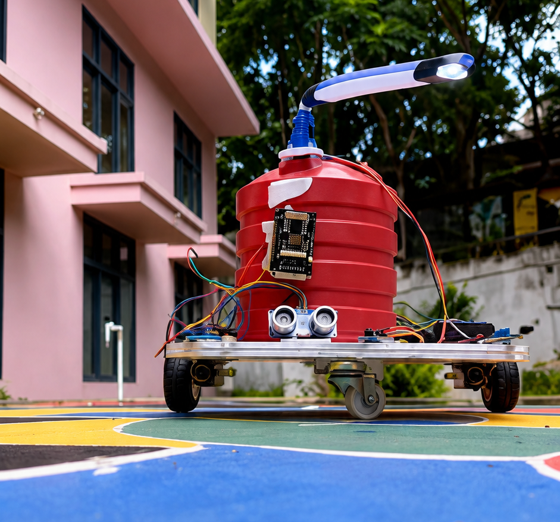

# ESP32 Firefighting Robot



An ESP32-based firefighting robot designed to detect fire, approach the fire, avoid obstacles, and spray water automatically. The robot can also be controlled manually using a mobile phone through Wi-Fi.

## Project Demo

[Watch the Firefighting Robot Demo](https://www.instagram.com/reel/DALlUGhy2Fu/?igsi=aGwwanpzZThsd2Zj)

## Features

* Three flame sensors for fire detection
* Automatic fire detection and extinguishing
* Automatic movement toward the fire
* Ultrasonic sensor for obstacle detection
* Automatic obstacle avoidance
* Water pump controlled using a relay
* Servo-controlled water nozzle
* Manual control using a mobile phone
* Wi-Fi access point using ESP32
* AUTO and MANUAL operating modes
* Emergency stop and pump OFF control
* Non-blocking program for responsive operation

## Hardware Required

* ESP32
* 3 Flame sensors
* HC-SR04 ultrasonic sensor
* L298N motor driver
* 2 DC motors
* Servo motor
* Relay module
* DC water pump
* Water tank
* Robot chassis
* Battery / external power supply
* 1kΩ resistor
* 2kΩ resistor
* Jumper wires

## Pin Configuration

| Component           | ESP32 Pin |
| ------------------- | --------: |
| Flame Sensor Left   |   GPIO 34 |
| Flame Sensor Center |   GPIO 35 |
| Flame Sensor Right  |   GPIO 32 |
| Ultrasonic TRIG     |    GPIO 5 |
| Ultrasonic ECHO     |   GPIO 18 |
| Motor IN1           |   GPIO 27 |
| Motor IN2           |   GPIO 26 |
| Motor IN3           |   GPIO 25 |
| Motor IN4           |   GPIO 33 |
| Motor ENA           |   GPIO 12 |
| Motor ENB           |    GPIO 4 |
| Servo               |   GPIO 13 |
| Relay               |   GPIO 14 |

## Wiring Notes

### HC-SR04

The HC-SR04 ECHO pin can output 5V, while the ESP32 GPIO is designed for 3.3V logic.

Use a voltage divider:

```text
HC-SR04 ECHO
     |
    1kΩ
     |
     +------ GPIO 18
     |
    2kΩ
     |
    GND
```

Connect the TRIG pin directly to GPIO 5.

### L298N Motor Driver

Remove the ENA and ENB jumpers if GPIO 12 and GPIO 4 are being used for motor speed control.

If the jumpers remain connected, the motors will operate at fixed full speed.

### Flame Sensors

GPIO 34, GPIO 35, and GPIO 32 do not have internal pull-up resistors.

If the flame sensor digital outputs are unstable, use external 10kΩ pull-up resistors to 3.3V.

### Relay

Relay modules can have different trigger polarities.

The program uses:

```cpp
RELAY_ACTIVE_LOW = false
```

Change this value if your relay works with LOW-level triggering.

### Flame Sensor Polarity

The default setting is:

```cpp
FIRE_DETECTED = LOW
```

If your flame sensors detect fire using HIGH instead, change it to:

```cpp
FIRE_DETECTED = HIGH
```

## Working Principle

### Automatic Mode

The robot operates using a non-blocking state machine.

```text
Start
  |
  v
Read Flame Sensors
  |
  v
Fire Detected?
  |
  +---- No ----> Move Forward
  |                 |
  |                 v
  |          Check Obstacle
  |                 |
  |          Obstacle Found
  |                 |
  |          Back and Turn
  |
  Yes
  |
  v
Identify Fire Direction
  |
  v
Move Toward Fire
  |
  v
Reach 25 cm or Timeout
  |
  v
Stop Robot
  |
  v
Aim Servo Nozzle
  |
  v
Activate Water Pump
  |
  v
Spray Water
  |
  v
Stop Pump
  |
  v
Return to Idle
```

The three flame sensors determine whether the fire is on the left, center, or right side.

* Left sensor detects fire → robot turns left
* Center sensor detects fire → robot moves forward
* Right sensor detects fire → robot turns right

The robot continues checking the sensors while approaching the fire.

When the robot reaches approximately 25 cm from the fire, or the approach timeout is reached, it stops and activates the water spraying system.

### Manual Mode

The robot can be controlled from a mobile phone using the Wi-Fi web interface.

Available controls:

* Forward
* Backward
* Left
* Right
* Stop
* Pump ON
* Pump OFF
* Nozzle Left
* Nozzle Center
* Nozzle Right
* AUTO mode
* MANUAL mode

The Stop button can cancel an automatic sequence and stop the robot.

## Obstacle Avoidance

The ultrasonic sensor continuously measures the distance in front of the robot.

If an obstacle is detected within the configured distance, the robot:

1. Stops
2. Moves backward
3. Turns
4. Continues moving forward

## Water Spraying System

The water system consists of:

```text
Water Tank
    |
    v
Water Pump
    |
    v
Relay
    |
    v
ESP32
```

The servo motor controls the direction of the nozzle.

The relay switches the water pump ON and OFF.

## Mobile Phone Control

The ESP32 creates its own Wi-Fi access point.

```text
Wi-Fi Name: FireRobot
Password: 12345678
IP Address: 192.168.4.1
```

Connect the mobile phone to the `FireRobot` Wi-Fi network and open:

```text
192.168.4.1
```

The control webpage can then be used to operate the robot.

## Configuration

| Parameter           | Default Value |
| ------------------- | ------------: |
| Fire Detection      |           LOW |
| Relay Active Low    |         false |
| Motor Speed         |           200 |
| Obstacle Distance   |         20 cm |
| Fire Spray Distance |         25 cm |
| Approach Timeout    |       6000 ms |
| Spray Time          |       3000 ms |

## Software Requirements

* Arduino IDE
* ESP32 Board Package
* ESP32Servo Library

Required libraries:

```cpp
#include <WiFi.h>
#include <WebServer.h>
#include <ESP32Servo.h>
```

## Installation

1. Install Arduino IDE.
2. Install the ESP32 board package.
3. Install the ESP32Servo library.
4. Connect the ESP32 to the computer.
5. Open `Firefighting_Robot.ino`.
6. Check and modify the configuration values if required.
7. Select the correct ESP32 board.
8. Select the correct COM port.
9. Upload the program.
10. Open Serial Monitor at 115200 baud.
11. Test the sensors, motors, servo, and relay.
12. Connect your phone to the `FireRobot` Wi-Fi network.
13. Open `192.168.4.1` in a browser.

## Project Structure

```text
ESP32-Firefighting-Robot/
├── Firefighting_Robot.ino
├── README.md
├── images/
│   └── robot.jpg
└── demo.mp4
```

## Future Improvements

* Fire intensity measurement
* Camera-based fire detection
* Automatic nozzle targeting
* Temperature sensor
* Better autonomous navigation
* Remote monitoring
* IoT-based alerts
* Larger water capacity

## Project Type

Embedded Systems | Robotics | IoT

## Author

Alkha
